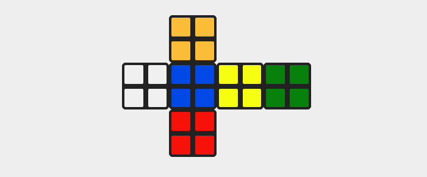
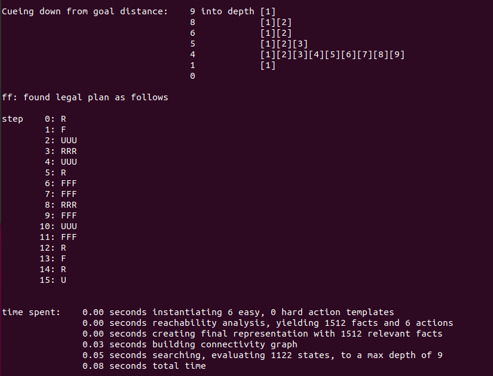
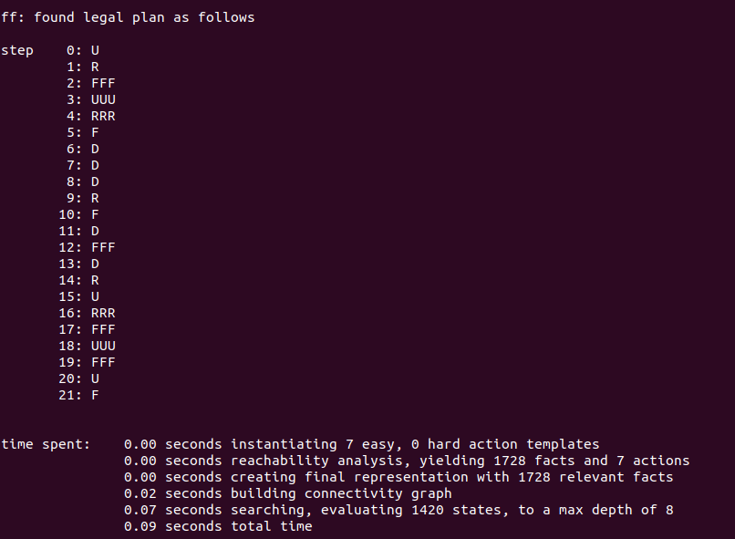
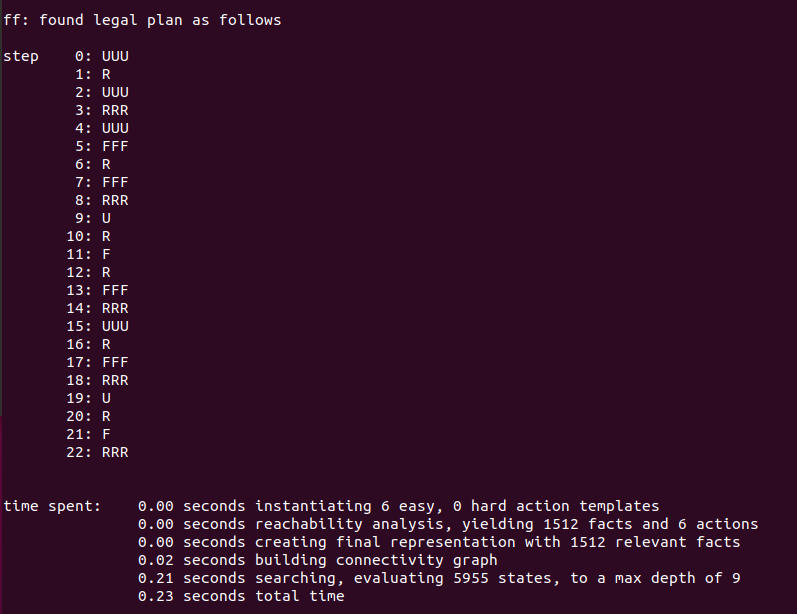
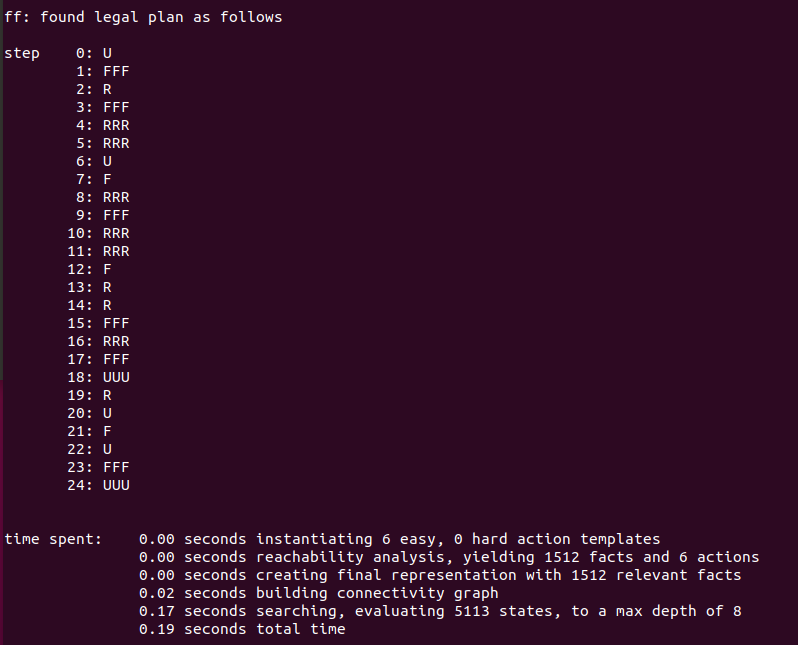

# P03-1 2 × 2 Rubik’s Cube


[TOC]


## 说明


四个样例中的 `domain.pddl` 大致是相同的，只是为了减少步数，定义动作的顺序可能有些许不同。

在 `prob.pddl` 定义初始状态和目标状态时的对应的位置关系如下：


**上图中动作旋转的是对应颜色的面**，颜色只是为了标注，真正定义时的颜色用的是：y-w，r-o，b-g，每组两个字母表示互为对面。

方块的顺序为：

```
上面         ------------               下面      ------------
           /  6  /  7  /                        /  2  /  3  /
          /-----/-----/                        /-----/-----/
         /  5  /  8  /                        /  1  /  4  /
         -----------                          -----------
                
```


此外，因为最初只定义了U,R,F，3个动作，这样方块2根本不会移动，**所以目标状态也是由方块2的初始状态决定的，也就是2X, 2Y, 2Z 这三个地方的颜色决定**。

涉及到的7个动作：

* U: 顺时针旋转上面四个方块；
* UUU：逆时针旋转上面四个方块；
* R：顺时针旋转右面四个方块；
* RRR：逆时针旋转右面四个方块；
* F：顺时针旋转前面四个方块；
* FFF：逆时针旋转前面四个方块；
* D：顺时针旋转下面四个方块；


为了减少步数，CASE 2增加了一个动作D，也就是底面顺时针旋转，但是这个动作对于其他情景并不会有优化，甚至会负优化，所以只用于CASE 2。动作定义的顺序会影响规划器的搜索过程。 **但是注意验证时，如果使用 [PDF中的网址]( https://rubiks-cube-solver.com/2x2/ )来验证的话，在该网页上底部红色顺时针旋转其实实际来说应该是逆时针旋转！(想象红色向后折叠，其时钟方向发生了调换，也就是说D动作，相当于把红色面顺时针旋转3次！！！)**




测试结果见后。

  <div STYLE="page-break-after: always;"></div>  


## 实验结果


### CASE 1

运行：

```
./ff -o domain1.pddl -f prob1.pddl
```

结果：




  <div STYLE="page-break-after: always;"></div>  


### CASE 2

运行：

```
./ff -o domain2.pddl -f prob2.pddl
```

结果：




  <div STYLE="page-break-after: always;"></div>  


### CASE 3

运行：

```
./ff -o domain3.pddl -f prob3.pddl
```

结果：




  <div STYLE="page-break-after: always;"></div>  


### CASE 4

运行：

```
./ff -o domain4.pddl -f prob4.pddl
```

结果：

