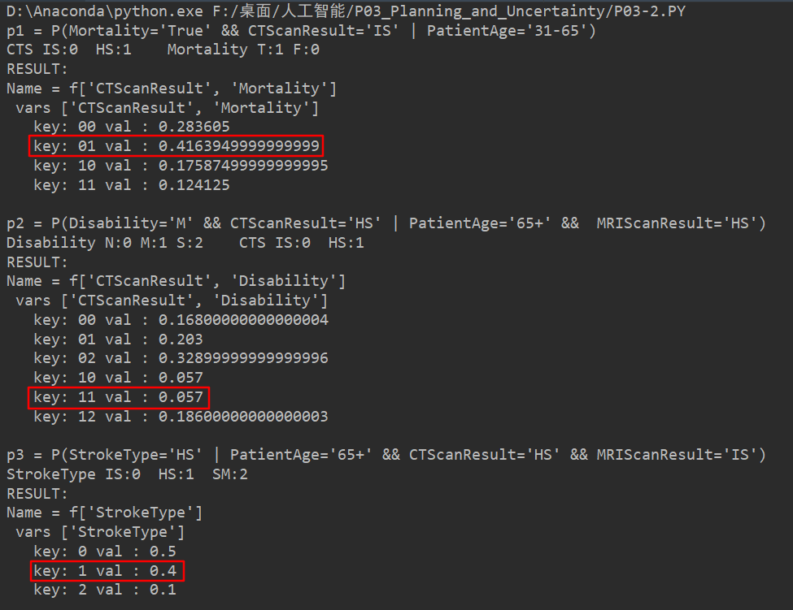
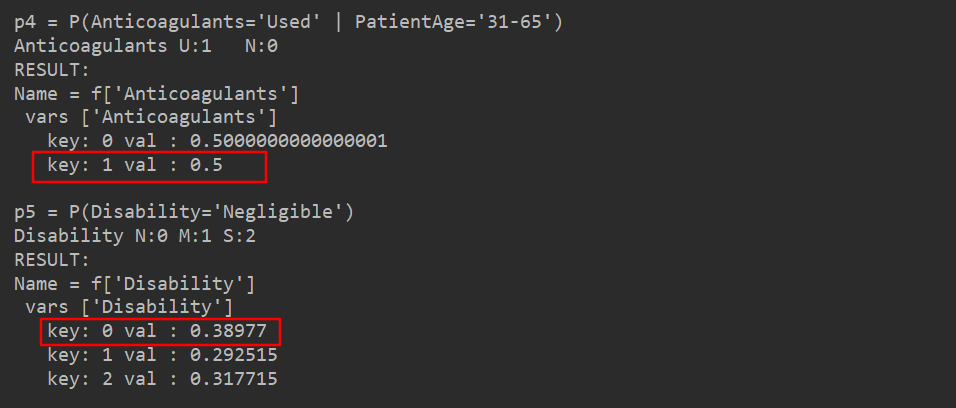

# P03-2 Diagnosing by Bayesian Networks


直接运行 `P03-2.py` 即可。在E11的代码基础上做了一些修改。要注意的是简化了变量的取值表示：

```
# PatientAge:['0-30','31-65','65+']    [0,1,2]
# CTScanResult:['Ischemic Stroke','Hemmorraghic Stroke']   [0,1]
# MRIScanResult: ['Ischemic Stroke','Hemmorraghic Stroke']  [0,1]
# StrokeType: ['Ischemic Stroke','Hemmorraghic Stroke', 'Stroke Mimic']  [0,1,2]
# Anticoagulants: ['Used','Not used']   [1,0]
# Mortality:['False', 'True']   [0,1]
# Disability: ['Negligible', 'Moderate', 'Severe']    [0,1,2]
```

其余见代码及注释。运行结果如下：




