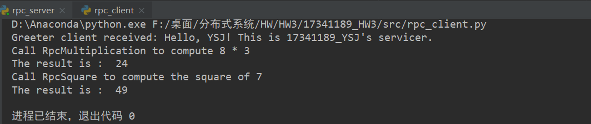
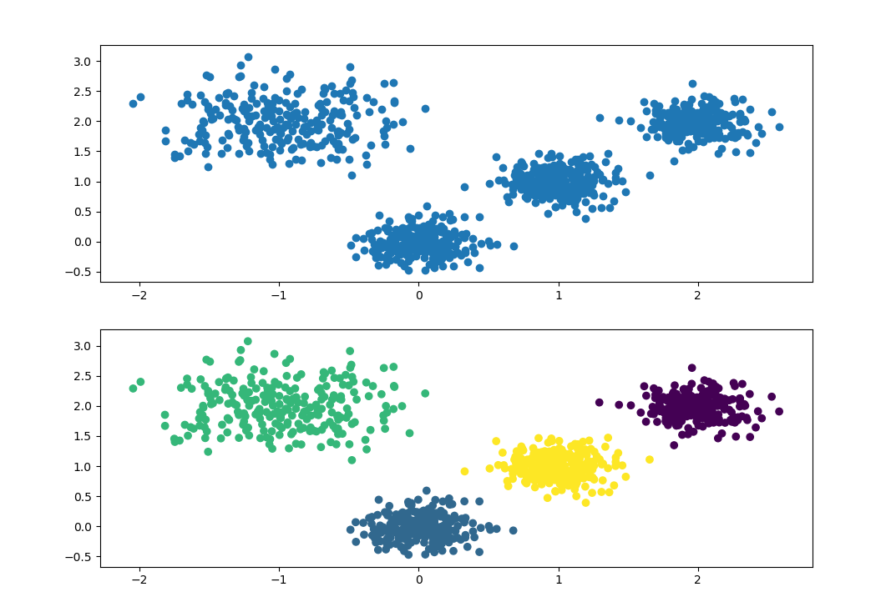
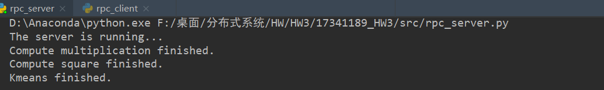

# 问题描述

远程过程调（RPC）用将网络编程变得非常简单。 根据所学的RPC相关原理，实现客户端-服务器通信， 并进行简单的计算如数据库查询、算术计算、数据 挖掘、深度学习推导等。

要求： 

1、采用gRPC；

 2、采用Protobuf作为C-S数据传输格式； 

3、服务器端采用线程池，支持并发； 

4、支持至少两种的计算服务如简单的算术 运算+数据挖掘算法（K-means、KNN等）； 

5、编程语言不做要求；  


# 解决方案

实现代码主要分为三个部分：

1. `rpc_client.py`: 客户端发起请求，与服务端连接后，传送需要计算的数据，远程调用服务器端的函数完成计算。
2. `rpc_server.py`: 服务端接受客户端的请求并完成对应的运算，返回结果。
3. `hw3.proto`: 我的理解是定义一些数据结构和函数声明（或者叫作接口），统一数据格式，使客户端和服务端能够正确通信。


下面就分析一下具体的代码：

### `hw3.proto`

首先是做类似于函数声明的工作：

```protobuf
service HW3 {
  rpc SayHello (HelloRequest) returns (HelloReply) {}
  rpc RpcMultiplication (Multiplication_input) 
  	  returns (Multiplication_output) {}
  rpc RpcSquare (Square_data) returns (Square_data) {}
  rpc RpcKmeans (Args) returns (Color) {}  
}
```

也就是声明了了4个服务，一是客户端服务端打招呼，这是官网上的例子；二是远程调用函数实现乘法运算；三是远程调用函数计算一个数的平方；最后是用K-means算法对一些点进行分类。


然后是具体的数据结构：

```protobuf
message HelloRequest {
  string name = 1;
}
message HelloReply {
  string message = 1;
}
```

这是从官方看到的例子，直接加入代码试了一下。


```protobuf
message Multiplication_input{
  int32 num1 = 1;
  int32 num2 = 2;
}

message Multiplication_output{
  int32 res = 1;
}

```

这是做乘法运算时用到的数据结构，服务端将计算 `num1 * num2` 的结果，返回一个`Multiplication_output`，其`res`为运算结果。


```protobuf
message Square_data{
  int32 data = 1;
}
```

这是求一个数的平方用到的数据结构，服务端将计算 `data * data`，由于输入和输出都是一个int，所以只需要定义一个`Square_data`即可。


```protobuf
message Args{
  repeated float x_coor = 1;
  repeated float y_coor = 2;
  int32 n_cluster = 3;
}

message Color{
	repeated int32 colors = 1;
}
```

这是做`K-means`聚类时用到的数据结构， `x_coor, y_coor`分别是一些点的横坐标和纵坐标数组，`n_cluster`是指类别数。下面的 `colors` 是每个点分类后的标签数组，用于画图。


然后就可以利用下面的命令将其编译为python代码了：

```
python -m grpc_tools.protoc -I. --python_out=. --grpc_python_out=. ./hw3.proto
```

这将会产生两个python代码文件，具体的内容我们暂时可以不管，我们只需知道这样我们就可以使得服务端和客户端通信并使用上面的数据结构了，具体函数的实现还得在服务端代码完成。

### `rpc_client.py`

这部分主要就是给出数据，将其传送到服务端，以下是测试：

```python
def run():
    # 与服务器提供服务的端口建立连接
    with grpc.insecure_channel('localhost:50051') as channel: 
        stub = hw3_pb2_grpc.HW3Stub(channel)

        # 测试1，打招呼
        response = stub.SayHello(hw3_pb2.HelloRequest(name='YSJ'))
        print("Greeter client received: " + response.message)

        # 乘法
        a = 8
        b = 3
        response = stub.RpcMultiplication(hw3_pb2.Multiplication_input(num1=a, num2=b))
        print(f"Call RpcMultiplication to compute {str(a)} * {str(b)} \n
        		The result is :", response.res)
        # print(type(response))

        # 平方
        c = 7
        response = stub.RpcSquare(hw3_pb2.Square_data(data=c))
        print(f"Call RpcSquare to compute the square of {c} \n
        		The result is : ",response.data)

        # 产生数据并调用RpcKmeans来分类，具体函数实现
        kmeans_test(stub)
```


至于 `kmeans_test()`函数，我是先随机产生了一些点，然后将这些点的坐标上传到服务端，然后调用服务端的`RpcKmeans()` 对这些点进行分类，将每个点分类后的标签传回客户端。

```PYTHON
def kmeans_test(stub):
    # 随机生成一些坐标，然后调用RpcKmeans来分类
    # 参数分别为  样本数，样本特征数， 中心点，每个类别的方差
    coordinate, _ = make_blobs(n_samples=1000, n_features=2, centers=[[-1, 2], 
				     [0, 0],[1, 1], [2, 2]],cluster_std=[0.4, 0.2, 0.2, 0.2])
    fig = plt.figure()
    fig.add_subplot(2, 1, 1)
    plt.scatter(coordinate[:, 0], coordinate[:, 1], marker='o')     # 原始数据画图

    # 调用RpcKmeans对坐标聚类, color即聚类后的标签
    color = stub.RpcKmeans(hw3_pb2.Args(x_coor=coordinate[:, 0], 
							y_coor=coordinate[:, 1],n_cluster=4))
    # 用远程调用 K-means聚类的函数的结果画图
    fig.add_subplot(2, 1, 2)
    plt.scatter(coordinate[:, 0], coordinate[:, 1], c=color.colors)
    plt.show()
```


### `rpc_server.py`

先开启服务端：

```PYTHON
def serve():
    # 线程池,支持多客户端同时使用
    server = grpc.server(futures.ThreadPoolExecutor(max_workers=10))    
    hw3_pb2_grpc.add_HW3Servicer_to_server(HW3(), server)             # 服务器与端口绑定
    server.add_insecure_port('[::]:50051')                            # 分配提供服务的端口
    server.start()
    print('The server is running...')
    server.wait_for_termination()
```

其中使用了：

```python
grpc.server(futures.ThreadPoolExecutor(max_workers=10))
```

来利用线程池，实现并发。剩下的就是具体函数的实现了：


```python
def SayHello(self, request,context):
    return hw3_pb2.HelloReply(message='Hello, %s! This is 17341189_YSJs servicer.'% request.name)
```

官网的例子，互相打招呼。


```python
def RpcMultiplication(self, request, context):    
    a = request.num1    
    b = request.num2    
    result = a * b    
    print('Compute multiplication finished.')    
    return hw3_pb2.Multiplication_output(res=result)
```

乘法运算。


```python
def RpcSquare(self, request, context):    
    a = request.data    
    result = a * a    
    print('Compute square finished.')    
    return hw3_pb2.Square_data(data=result)
```

求发来的数的平方。


```PYTHON
def RpcKmeans(self, request, context):
    x = request.x_coor
    y = request.y_coor
    n = request.n_cluster
    coordinate = []
    for i in range(len(x)):
    	coordinate.append([x[i], y[i]])
        colors_predict = KMeans(n_clusters=n).fit_predict(coordinate)
        print('Kmeans finished.')
        return hw3_pb2.Color(colors=colors_predict)
```

对接收到的点进行分类。首先将x，y坐标列表组合成真正的坐标，再直接调用`sklearn.cluster`中的`KMeans()`方法对这些点分类，然后将分类结果依次写到数组返回。


# 实验结果

先编译`hw3.proto`：

```
python -m grpc_tools.protoc -I. --python_out=. --grpc_python_out=. ./hw3.proto
```

然后先运行 `rpc_server.py`, 再运行 `rpc_client.py`.

为了方便检查作业，没有采用输入数据的方式，如果要修改作运算的数的话，请在`rpc_client.py`中修改。

下面是运行结果。

客户端：



以及K-means分类结果如下，这些点是随机产生的，故测试时可能有些许差异。下图中上部分是用原数据画的图，下面部分是用远程调用传回来的分类结果画的图：



服务端：




同时运行两个客户端：


