# 数字图像处理实验4


# 问题描述

1. 频率域滤波降噪
3.  RGB图像做直方图均衡 


# 实验过程及分析


## 频率域滤波降噪

### 实验原理

对图像做傅里叶变换后，频率域使用巴特沃斯带阻滤波，从而去掉周期性噪声。本次使用的时4阶巴特沃斯带阻滤波，能够将以中心点为圆心的某个有宽度的圆环上的噪声去掉，该滤波具体的表达式为：

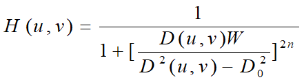

可以看到表达式中函数三个参数可以由我们自己决定，分别时阶数n，频谱中心半径D0，频带的宽度W，所以设计函数的时候输入的参数也是这三个。


### 函数设计

主要用的函数就是 `my_butterworth()`，在该函数中先对图像做中心化处理，再做傅里叶变换，得到F, 然后构造一个由输入参数决定的巴特沃斯带阻滤波器H，将其与F做点乘后，再做傅里叶反变换以及中心化处理，得到结果。具体代码如下：

```matlab
function my_butterworth(W, d0, n, img)
    % 中心化处理
    im = shift_to_center(img);
    % 傅里叶变换
    % fft2 结果是复数
    % 显示频谱时才需要取abs
    F = fft2(im);
    
    % 显示频谱
    F_show = abs(F);
    figure;
    imshow(F_show .^ 0.2,[])
    title('傅里叶频谱');

    % 巴特沃斯带阻滤波器
    [row,col]=size(F); 
    u0=floor(row/2);
    v0=floor(col/2); 
    H = ones(row,col);
    for i = 1:row
        for j = 1:col
             d = sqrt((i-u0)^2+(j-v0)^2); 
             H(i,j) = 1 / (1+( (d*W)/(d^2-d0^2))^(2*n) );  
        end
    end

    % 显示滤波器
    figure;
    imshow(H);
    title('4阶巴特沃斯带阻滤波器')

    % 频率域上的结果
    G = H .* F;
    % figure;
    % imshow(abs(G));
    % title('G')

    % 反变换
    G = ifft2(G);
    im_after=real(G);
    im_after = shift_to_center(im_after);
    figure;
    imshow(im_after);
    title(['W=',num2str(W), ' d0=', num2str(d0),' 使用带阻滤波后图像']); 
end
```

上面用到的中心化处理的函数就是之前的实验写好的`shift_to_center()`:

```matlab
function  im = shift_to_center(img)
	[m, n] = size(img);
    im = double(img);
    for i =  1:m
        for j = 1:n
            im(i,j) = im(i,j)*((-1)^(i+j));
        end
    end
end
```


### 实验结果

原始图像：

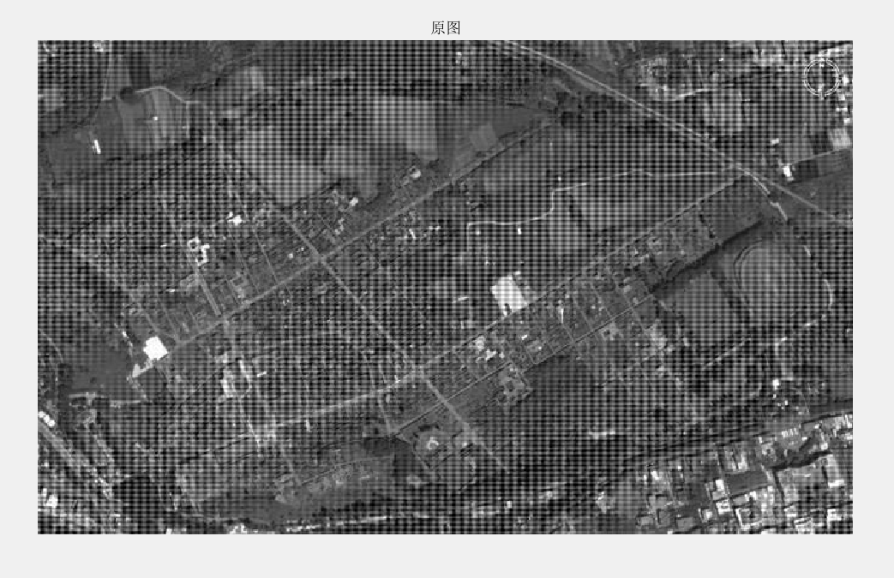

可以看到有很多比较规律的噪声。显示一下原图的傅里叶频谱：

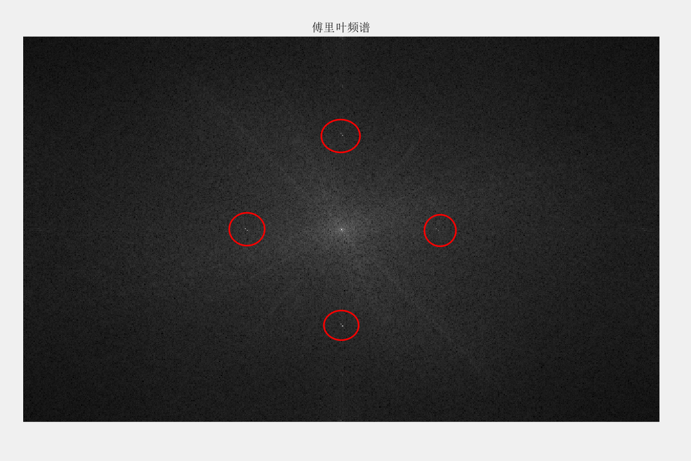

可以看到再红圈勾出来的几个地方存在一些很亮的点，这些就是原图的周期噪声，我们的目的就是消除他们。

取`W=5,d0=100,n=4`，使得噪声在圆环上，构造的巴特沃斯滤波器如下：

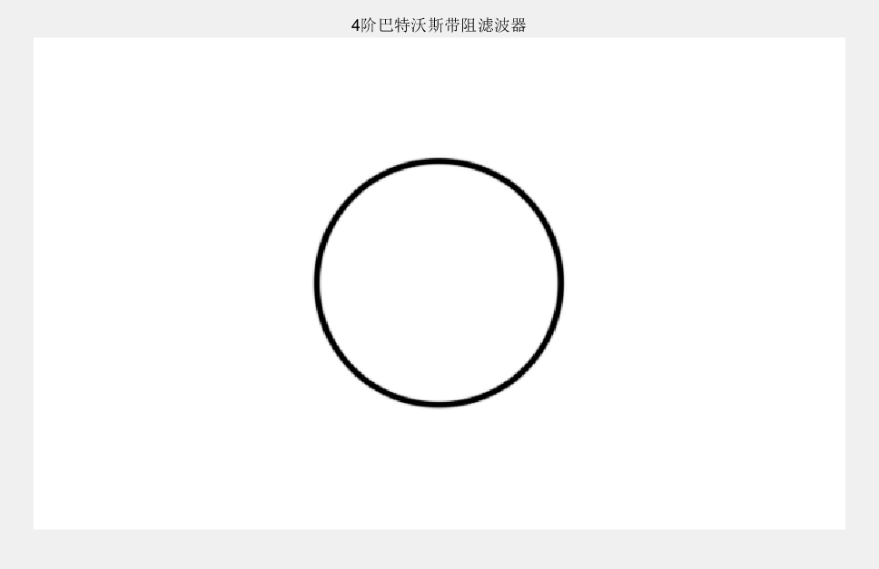


以下是调用上面的`my_butterworth()`处理图像的最终结果，先上原图进行对比：


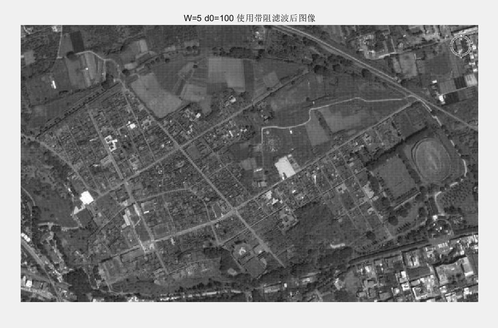

可以看到效果比较好，那些比较规律的噪声就被去除了。


## RGB图像做直方图均衡 

### 实验原理

对比一下对RGB图像做直方图均衡的两种方式，一是分通道分别进行直方图均衡，二是直接对RGB三通道的值进行直方图均衡，比较以下两者的区别。分通道时直接分别取出三个通道的矩阵，分别调用之前的实验写好的直方图均衡的函数`HistogramEqulization()`即可。使用第二种方法时，仅仅需要在`HistogramEqulization()`的基础上稍作修改，使得在统计像素频率和改变像素值时包含三个通道的值即可。


### 函数设计

`HistogramEqulization()`函数以及原理，在之前的实验中已经详细描述过了，这里也不再赘述，这里说说在其基础上修改的用于彩色图像直方图均衡的函数`rgb_he()`, 其输入的参数为待处理图像，无返回，主要的修改就是统计像素频率和改变像素值时包含了三个通道的值。

```matlab
function pic_after_process = rgb_he(im0)
    newimg = im0;
    im = uint8(im0);
    % disp(size(im))
    [x,y,z] = size(im); 
    imr = im(:,:,1);
    img = im(:,:,2);
    imb = im(:,:,3);
    % 1*256矩阵，记录概率
    p_gray_scale = zeros(1,256);

    % 对个灰度值计数算频率
    for i = 0:255
        timesr = length(find(imr==i));
        timesg = length(find(img==i));
        timesb = length(find(imb==i));
        times = timesr +timesg+ timesb;
        p_gray_scale(i+1) = times / (x*y*z);
    end

    % 累积函数
    P = zeros(1,256);
    P(1) = p_gray_scale(1);
    for i = 2: 256
        P(i) = P(i-1) + p_gray_scale(i);
    end

    % 变换的图片
    s = round(P*255);
    pic_after_process = im;
    for i = 0: 255
        pic_after_process(find(newimg(:,:,1)==i)) = s(i+1);
        pic_after_process(find(newimg(:,:,2)==i)) = s(i+1);
        pic_after_process(find(newimg(:,:,3)==i)) = s(i+1);
    end
end
```


### 实验结果

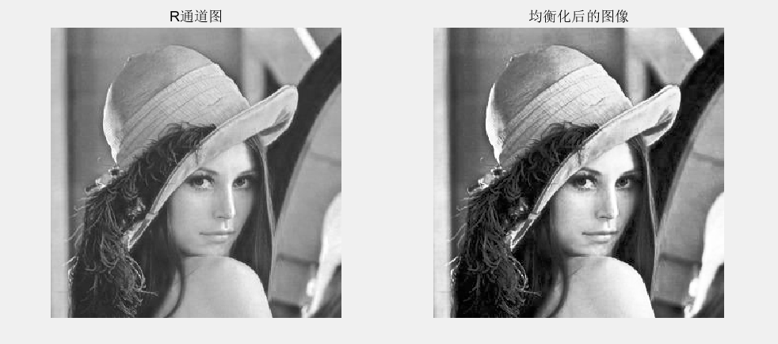

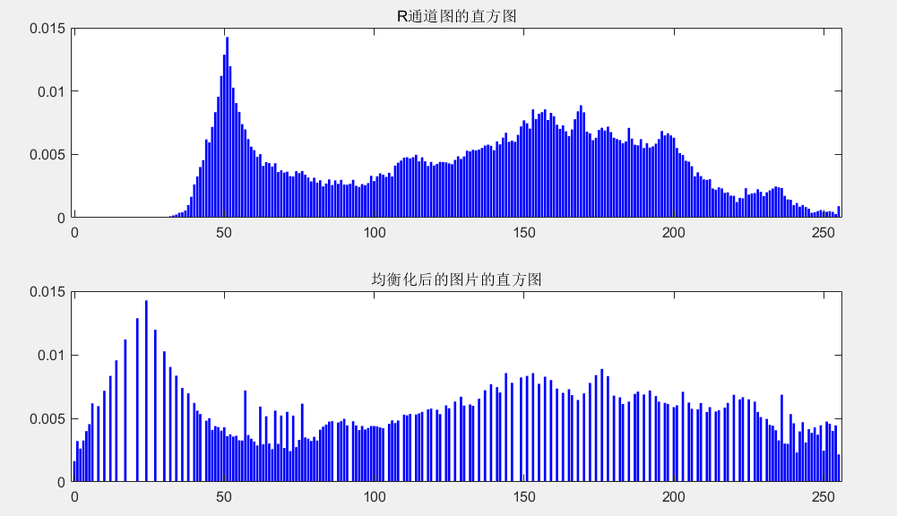

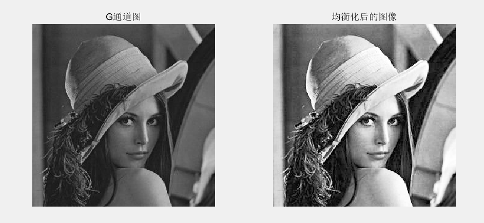

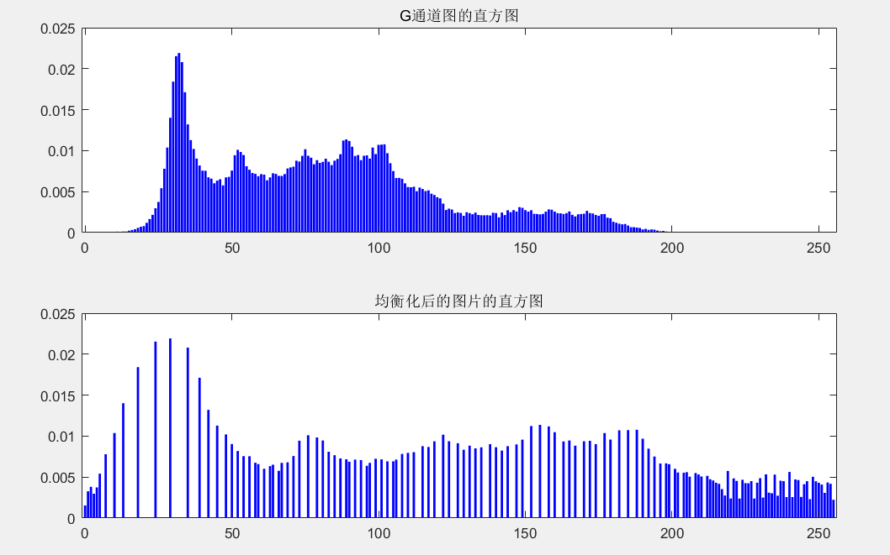

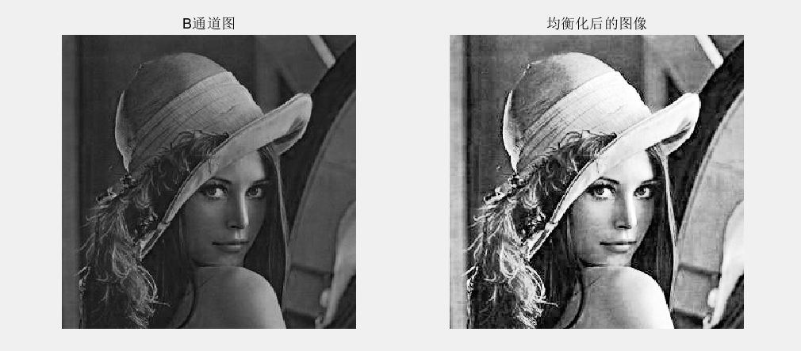

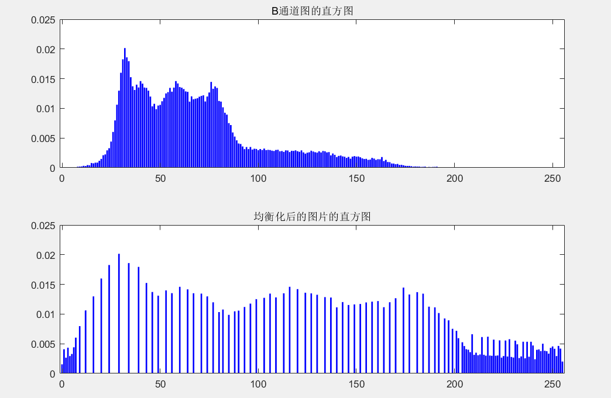


直方图均衡化后的结果：

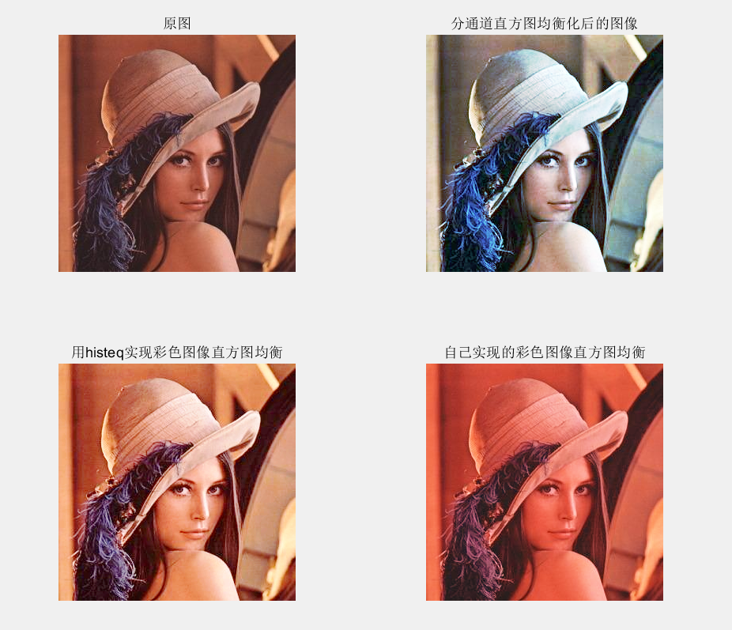

这里要说明一下的是，**没有查到 `histeq()`函数可以直接处理彩色图像**，官方文档里面好像也没有明说，这里只是试了一下，结果未必正确。

从上面可以看到，分三通道对图像进行直方图均衡和直接对图像进行直方图均衡的结果是不一样的。


