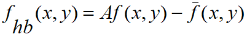
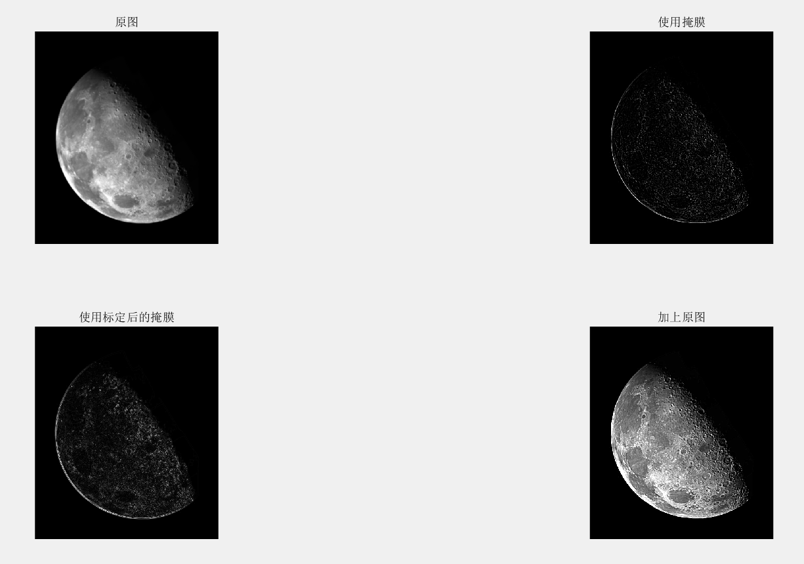
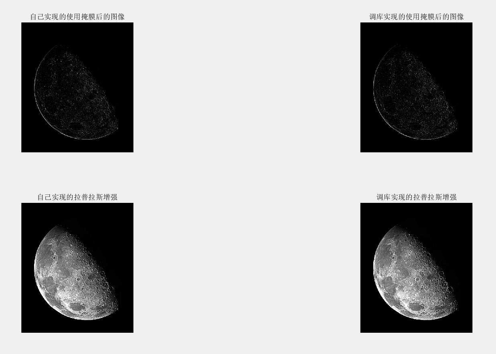
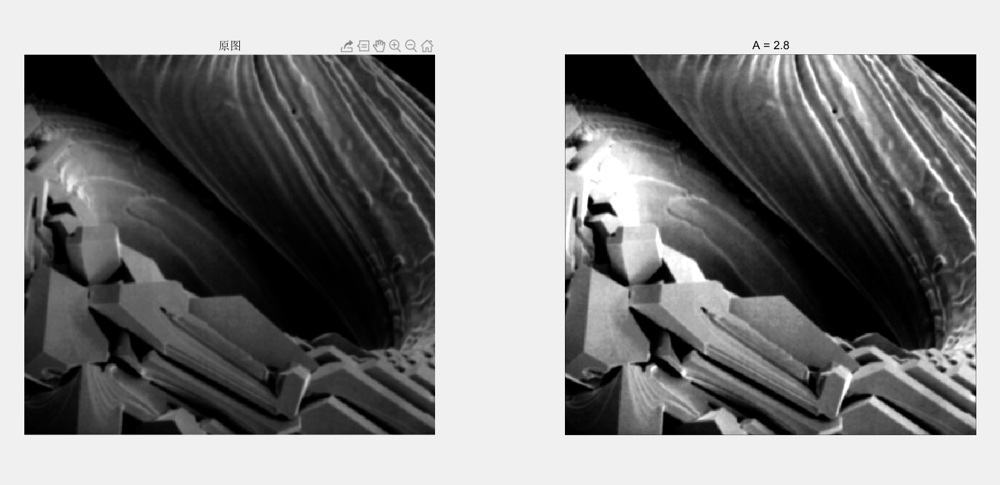
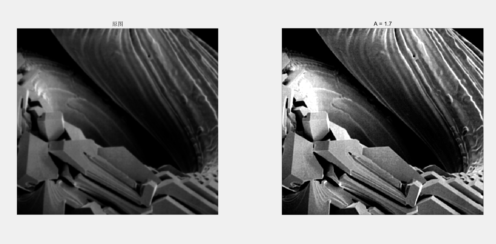

# 问题详情


### 1. Enhancement Using the Laplacian（PROJECT 03-05）

(a) Use the programs developed in Projects 03-03 and 03-04 to implement the Laplacian enhancement technique described in connection with Eq. (3.7-5).  Use the mask shown in Fig. 3.39(d).

(b) Duplicate the results in Fig. 3.40.  You will need to [download](http://www.imageprocessingplace.com/DIP-2E/dip2e_book_images_downloads.htm) Fig. 3.40(a).


### **2. Unsharp Masking**  （PTOJECT 03-06）

(a) Use the programs developed in Projects 03-03 and 03-04 to implement high-boost filtering, as given in Eq. (3.7-8).  The averaging part of the process should be done using the mask in Fig. 3.34(a).

(b) [Download](http://www.imageprocessingplace.com/DIP-2E/dip2e_book_images_downloads.htm) Fig. 3.43(a) and enhance it using the program you developed in (a).  Your objective is to choose constant *A* so that your result visually approximates Fig. 3.43(d).


# 主要思路

 主要的思路都是通过循环遍历每个像素点，取它周围的一些点进行运算。要注意的是，实现时，考虑到周边的一行或者一列像素对整体的影响不是很大，所以忽略了周边边界的像素点，如果要处理他们可以在循环的里面加上一些判断语句，对他们做特殊处理即可。

此外对于 PROJECT 03-06, 在a题中要求用高提升滤波的一般表达式：



而在第二题中要求用基于拉普拉斯算子的高提升滤波，所以给出了两种实现，见`my_h_boost_filter_avg(im0, A)` 和 `my_h_boost_filter_lpls(im0, A)`函数。


# 实验结果


### Enhancement Using the Laplacian






可以看到效果符合要求。


### Unsharp Masking

使用高提升滤波的一般表达式：




使用基于拉普拉斯算子的高提升滤波



可以看到后者和书上的图相同，说明实现没有问题。


# 具体实现


### Enhancement Using the Laplacian

本此实验的关键部分就是实现滤波的函数部分，所以就只列出了该函数的实现：

`project0305.m`

```matlab
% 拉普拉斯图像增强
function [im_use_mask, im_enhanced, im_abs_mask] = my_filter(im0, mask)
% 输入参数分别是原图像，掩膜
% 返回处理后的图像
    im = im2double(im0);
    [x,y] = size(im)
    im_enhanced = im;       % 最终增强的结果，加上了原图
    im_abs_mask = im		% 使用标定后的掩膜
    im_use_mask = im;		% 使用原始掩膜
    % 忽略了边界
    for i = 2: x-1
        for j = 2: y-1
            neighbor = im([i-1,i,i+1], [j-1,j,j+1]);
            im_use_mask(i,j) = sum(sum(neighbor .* mask));
            im_abs_mask(i, j) = abs(im_use_mask(i,j));
            im_enhanced(i, j) =  im(i,j) + im_use_mask(i,j);
        end
    end
end
```


### Unsharp Masking

`project0306.m`

```matlab
% 均值
function im_enhanced = my_h_boost_filter_avg(im0, A)
% 输入参数分别是原图像，系数
% 返回处理后的图像
    im = im2double(im0);
    [x,y] = size(im)
    im_enhanced = im;
    % 忽略了边界
    for i = 2: x-1
        for j = 2: y-1
            neighbor = im([i-1,i,i+1], [j-1,j,j+1]);
            avg(i,j) = sum(sum(neighbor))/9;           % 均值
            im_enhanced(i, j) =  A*im(i,j) - avg(i,j);
        end
    end
end


% 基于拉普拉斯
function im_enhanced = my_h_boost_filter_lpls(im0, A)
% 输入参数分别是原图，系数
% 返回处理后的图像
    im = im2double(im0);
    [x,y] = size(im)
    im_enhanced = im;
    mask = [-1,-1,-1;-1,A+8,-1;-1,-1,-1]            % 要求的掩膜
    % 忽略了边界
    for i = 2: x-1
        for j = 2: y-1
            neighbor = im([i-1,i,i+1], [j-1,j,j+1]);
            im_enhanced(i, j) =  sum(sum(neighbor .* mask));
        end
    end
end
```

