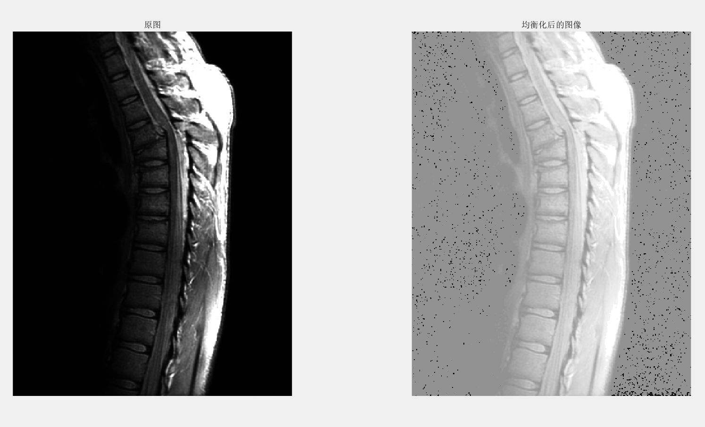
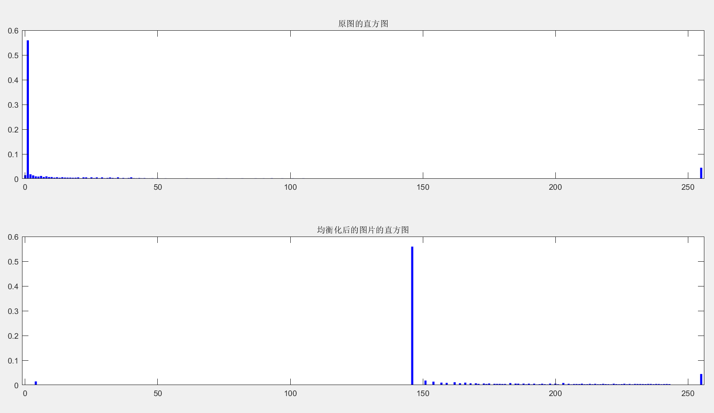
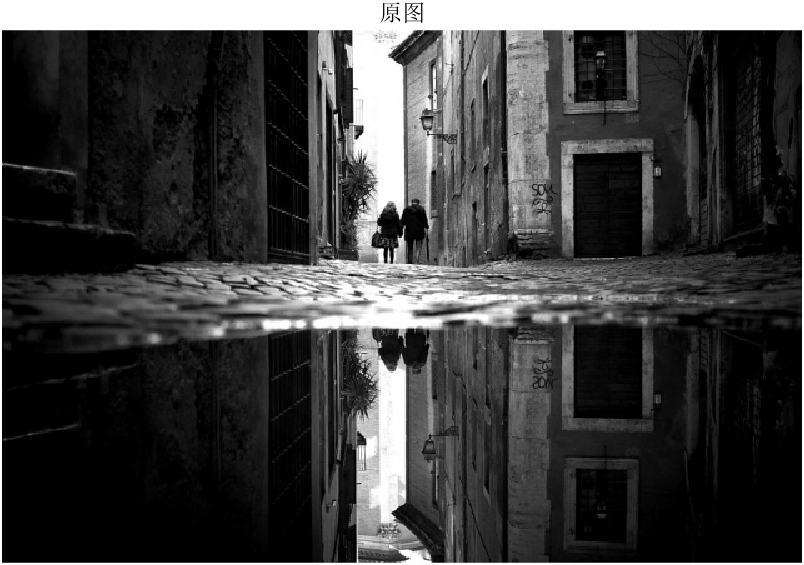
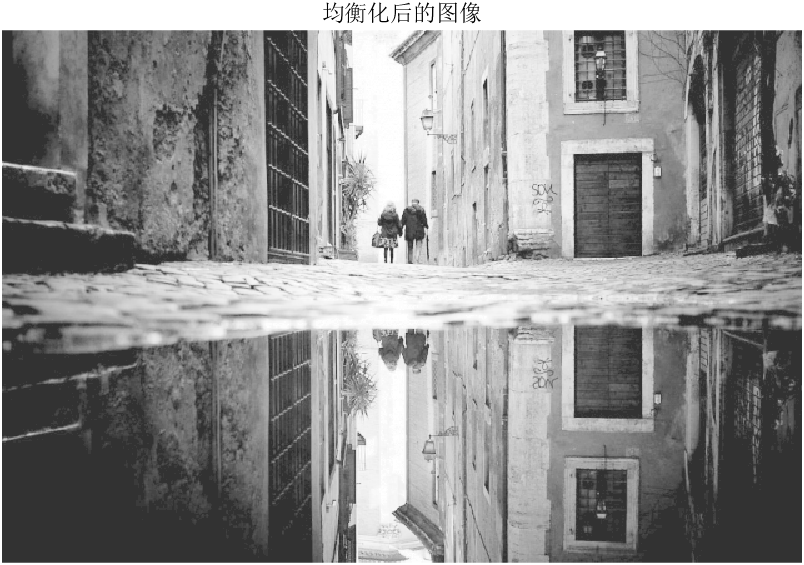
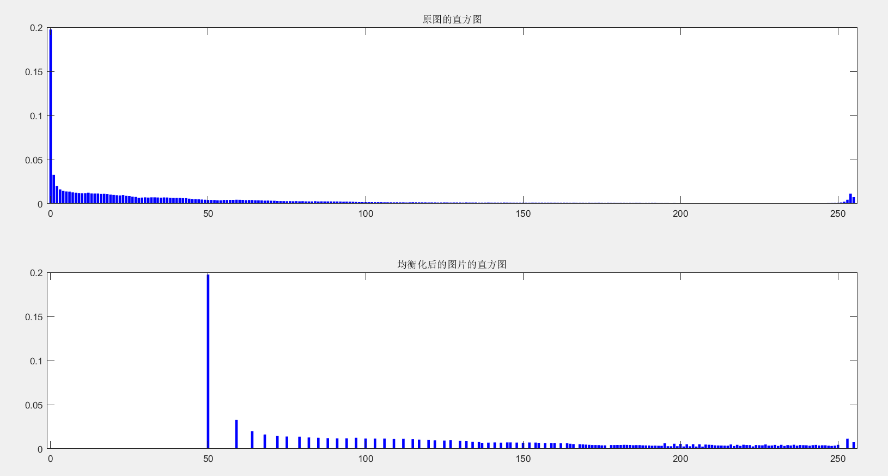
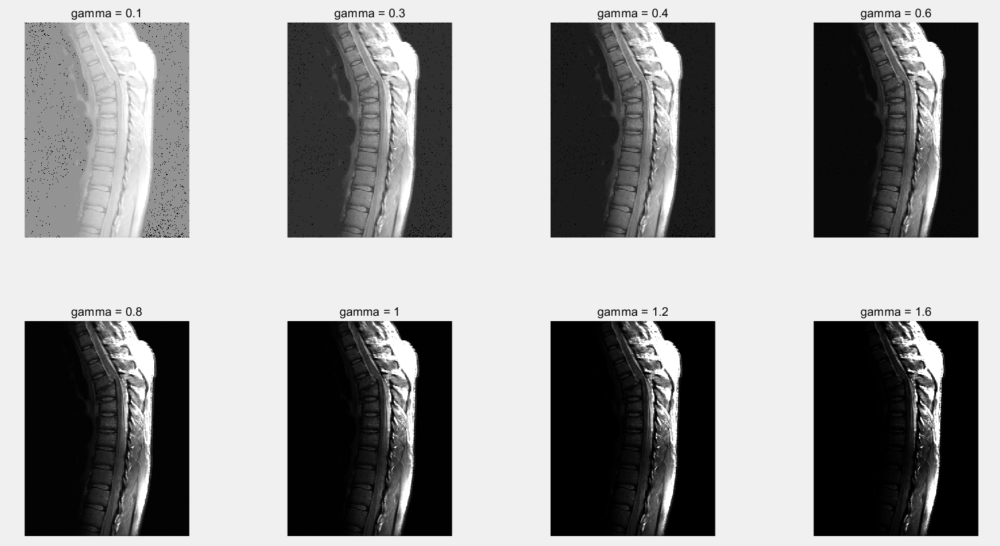

# 问题详情
 

### 1. Histogram Equalization

(a) Write a computer program for computing the histogram of an image.

(b) Implement the histogram equalization technique discussed in Section 3.3.1.

(c) Download Fig. 3.8(a) from the book web site and perform histogram equalization on it.

As a minimum, your report should include the original image, a plot of its histogram, a plot of the histogram-equalization transformation function, the enhanced image, and a plot of its histogram. Use this information to explain why the resulting image was enhanced as it was.

 

### 2. gamma 校正

实现伽马校正，并找图片测试。

 

# 主要思路

在做直方图均衡化时，主要通过 `find()`函数返回各个灰度值的在图片矩阵中下标矩阵，然后用`length()`函数即可求出各个灰度值的频率。然后利用循环就可以找出累积函数和变换，从而得到处理后的图片。

在做伽马校正时，分别取不同的 gamma 值，遍历每个像素，并对每个像素做    的运算操作后，显示图像即可。

 

# 实验结果

### Histogram Equalization

先完成题目要求，对书中 Fig. 3.8(a) 进行直方图均衡化 

可以看到处理后的图片和书上几乎相同，整体变亮，有很多噪声。这是因为原图的灰度值分布较为集中，灰度偏暗，使用变换函数s之后，灰度值发生跳跃，且累积函数是递增的，整体也就变亮了，少数的灰度值较暗的像素点就变得很突出。另外因为主要是灰度值发生了变化，他们频率的分布趋势还是大致不变的。

这张图像素分布太集中了，效果不是很好，于是另外找了一张进行测试：

可以看到效果不错。

### gamma 校正

使用不同的 gamma 对图像进行校正，可以看到， gamma = 0.3, 0.4, 0.6   时，和PPT上的效果是差不多的。图像偏暗时，有些低灰度值的细节被掩盖，用小一点的伽玛校正效果较好，因为经过指数小于1的伽马变换后，灰度值变大，图像变亮。
